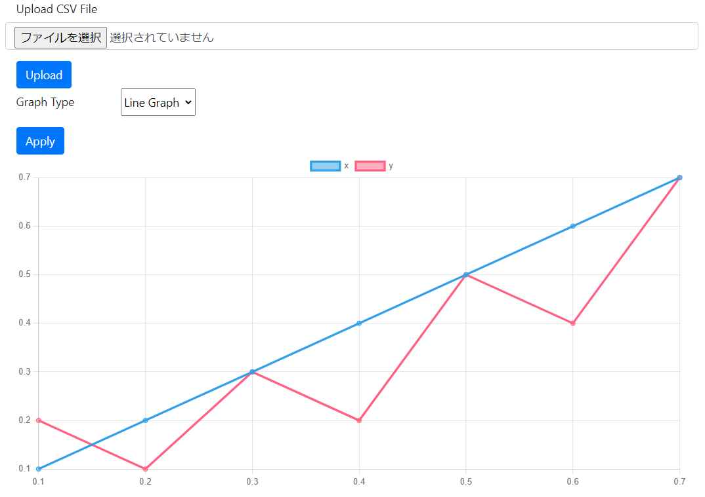
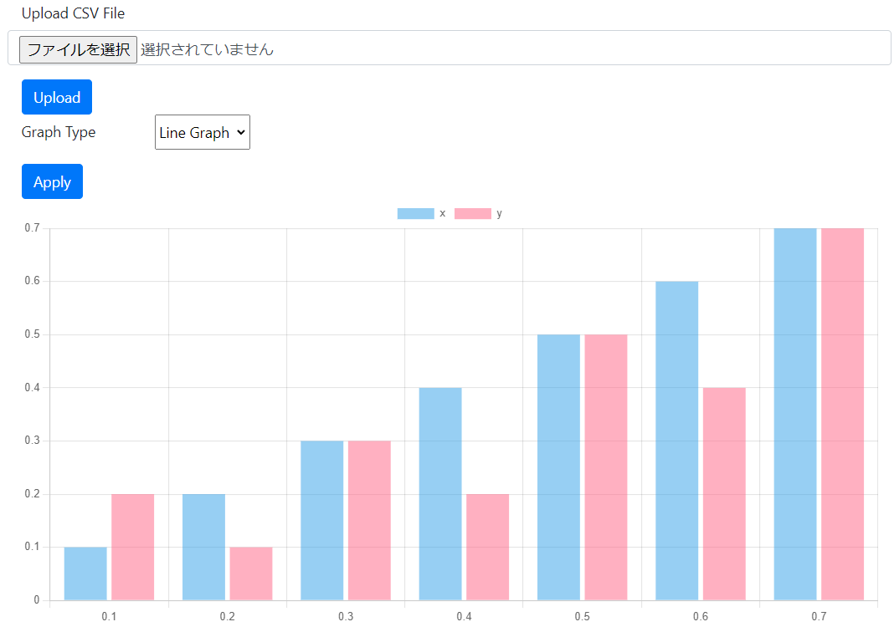
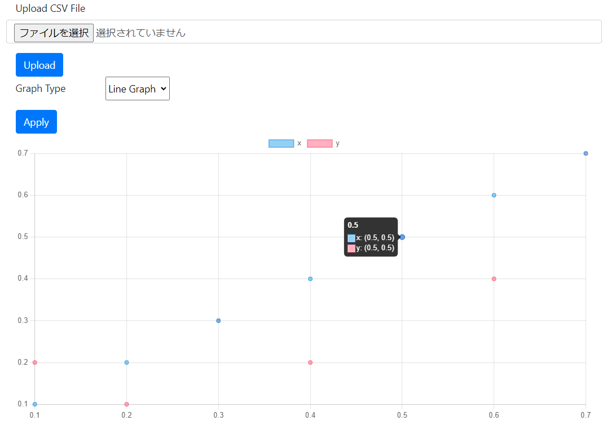

# Graph Drawer

## Overview

`Graph Drawer` is Web application to draw the graph automatically.  
The file format is supported in `csv`.

## Environment (confirmed operation)

- WSL2 (Windows11)
- Ubuntu 22.04.1 LTS (Jammy Jellyfish)
- docker-compose version 1.29.2

## How to use

```
./run.sh
```

Access to `http://localhost:5000` in your browser.

### Execution sample using `sample_data/sample1/sample.csv`

#### Line plot



#### Bar plot



#### Scatter plot


